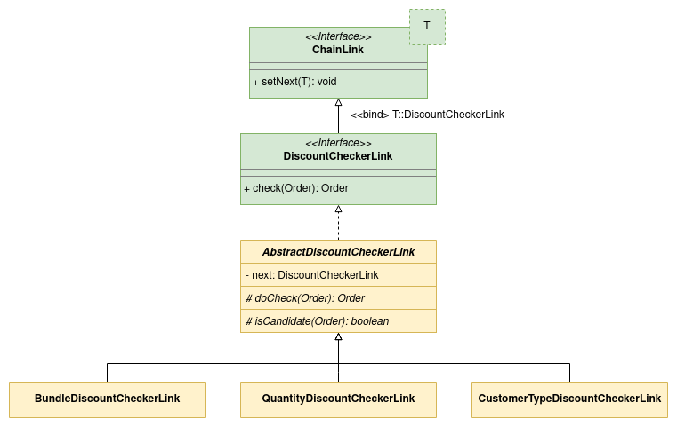

# Chain With Ordered Links

This project presents how to use [COR Bean Processor Spring Boot Starter](https://github.com/MarceloLeite2604/cor-bean-processor-spring-boot-autoconfiguration) to create a chain with links in a specific order.

The logic objective in this project is to calculate order discounts. Each order is composed of items, their amounts and the type of customer that wants to buy it.
There are three different types of discounts that the program can provide: Bundle, quantity and customer type.

Bundle discounts are given when customers buy a specific group of different items. The discount reduces a percentage on the bundle pack price.

| Bundle Discount Name | Items And Quantity                       | Discount Percentage |  
|:---------------------|:-----------------------------------------|--------------------:|
| Quick Snack Pack     | 1 sandwich, 1 juice box, 1 chocolate bar |                 18% |
| Family Meal          | 3 sandwiches, 3 juice boxes              |                 22% |
| Refresh Flash        | 2 juice box, 2 chocolate bars            |                  8% |

Quantity discounts are given when customers buy a certain amount of the same item. The discount reduces a percentage on the item quantity price.

| Quantity Discount Name | Items And Quantity | Discount Percentage |
|:-----------------------|:-------------------|--------------------:|
| Refreshing dozen       | 12 juice boxes     |                 10% |
| 3+1 sandwiches         | 4 sandwiches       |                 25% |
| Delicious trio         | 3 chocolate bars   |                  5% |

Customer type discounts are given for different customer types. Usual customers do not receive any discount, while frequent customers are given a 3% discount on all items.

Bundle and quantity discounts are non-stackable and bundle discounts have a higher priority. This means that if an order already has bundled discounts, it cannot receive quantity discounts. On the opposite, if the order does not have any bundle discount, then quantity discounts are checked.
Customer discounts are always given regardless if the order already has other discounts applied.

The discounts are given based on a chain of responsibility model.



But since we have discount types with different priorities, we need to order the chain as follows:

1. Bundled discounts
2. Quantity discounts
3. Customer type discounts

# Highlights

[`DiscountCheckerLink`][discount-checker-link] interface extends [COR Bean Processor Spring Boot Starter `ChainLink<T>` interface][chain-link] passing a self-reference as parameter. It also contains the entry method used to check and apply a discount type for an order.
```java
public interface DiscountCheckerLink extends ChainLink<DiscountCheckerLink> {

  Order check(Order order);
}
```

[`AbstractDiscountCheckerLink`][abstract-discount-checker-link] is an abstract class that implements [`DiscountCheckerLink`][discount-checker-link] interface.  It also implements `check` method demanded by [`DiscountCheckerLink`][discount-checker-link] and `setNext` method demanded by [`ChainLink`][chain-link]. The latter is implemented using [Lombok `@Setter` annotation][lombok-setter].

Since discount types depends on certain rules to be applied, the class declares an abstract method `isCandidate`, demanding its specializations to implement a method to check if analysed order is a valid candidate for discounts.

To separate the chain execution from the actual discount application, the class also declares an abstract method `doCheck`, which will be executed if the order is a candidate for the discount type checking. Inside it, the class specializations will elaborate the logic to apply the discounts.   
```java
public abstract class AbstractDiscountCheckerLink implements DiscountCheckerLink {

  @Setter
  private DiscountCheckerLink next;

  @Override
  public Order check(Order order) { /* Full logic can be checked on the class implementation. */ }

  protected abstract Order doCheck(Order order);

  protected abstract boolean isCandidate(Order order);
}
```

[`BundleDiscountCheckerLink`][bundle-discount-checker-link], [`QuantityDiscountCheckerLink`][quantity-discount-checker-link] and [`CustomerTypeDiscountCheckerLink`][customer-type-discount-checker-link] classes extend [`AbstractDiscountCheckerLink`][abstract-discount-checker-link] abstract class and implement the logic to apply the discounts.
They are also decorated with [Spring `@Order` annotation][spring-order-annotation] to specify the link order in the chain.

```java
@Order(10)
public class BundleDiscountCheckerLink extends AbstractDiscountCheckerLink {

  @Override
  protected Order doCheck(Order order) { /* Full logic can be checked in the class implementation. */ }

  @Override
  protected boolean isCandidate(Order order) { /* Full logic can be checked in the class implementation. */ }
}
```

```java
@Order(20)
public class QuantityDiscountCheckerLink extends AbstractDiscountCheckerLink {

  @Override
  protected Order doCheck(Order order) { /* Full logic can be checked in the class implementation. */ }

  @Override
  protected boolean isCandidate(Order order) { /* Full logic can be checked in the class implementation. */ }
}
```

```java
@Order(30)
public class CustomerTypeDiscountCheckerLink extends AbstractDiscountCheckerLink {

  @Override
  protected Order doCheck(Order order) { /* Full logic can be checked in the class implementation. */ }

  @Override
  protected boolean isCandidate(Order order) { /* Full logic can be checked in the class implementation. */ }
}
```

[`DiscountService`][discount-service] encapsulates the components required to check and calculate order discounts.
It contains a `calculateDiscounts` method which invokes the first link `check` method, starting the chain analysis.
```java
public class DiscountService {

  private final DiscountCheckerLink firstLink;

  public Order calculateDiscounts(Order order) {
    return firstLink.check(order);
  }
}
```

## Execution

The complete integration with Spring Boot can be checked on [`DiscountServiceIT`][discount-service-it]. It is an integration test class and can be executed through an IDE like [IntelliJ IDEA][intellij-idea], [Eclipse][eclipse] or [Microsoft Visual Studio Code][microsoft-visual-studio-code].

Alternatively, the tests can also be executed through a terminal running the following command on this module root directory.

```bash
mvn test-compile failsafe:integration-test
```

[abstract-discount-checker-link]: ./src/main/java/com/figtreelake/orderedlinks/service/discount/link/AbstractDiscountCheckerLink.java
[bundle-discount-checker-link]: ./src/main/java/com/figtreelake/orderedlinks/service/discount/link/BundleDiscountCheckerLink.java
[chain-link]: https://github.com/MarceloLeite2604/cor-bean-processor-spring-boot-autoconfiguration/blob/main/autoconfigure/src/main/java/com/figtreelake/corbeanprocessor/autoconfigure/link/ChainLink.java
[cor-bean-processor]: https://github.com/MarceloLeite2604/cor-bean-processor-spring-boot-autoconfiguration
[customer-type-discount-checker-link]: ./src/main/java/com/figtreelake/orderedlinks/service/discount/link/CustomerTypeDiscountCheckerLink.java
[discount-checker-link]: ./src/main/java/com/figtreelake/orderedlinks/service/discount/link/DiscountCheckerLink.java
[discount-service]: ./src/main/java/com/figtreelake/orderedlinks/service/discount/DiscountService.java
[discount-service-it]: ./src/test/java/com/figtreelake/orderedlinks/service/discount/DiscountServiceIT.java
[eclipse]: https://www.eclipse.org/downloads/
[intellij-idea]: https://www.jetbrains.com/idea/
[lombok-setter]: https://projectlombok.org/features/GetterSetter
[microsoft-visual-studio-code]: https://code.visualstudio.com/download
[spring-order-annotation]: https://docs.spring.io/spring-framework/docs/current/javadoc-api/org/springframework/core/annotation/Order.html
[quantity-discount-checker-link]: ./src/main/java/com/figtreelake/orderedlinks/service/discount/link/QuantityDiscountCheckerLink.java