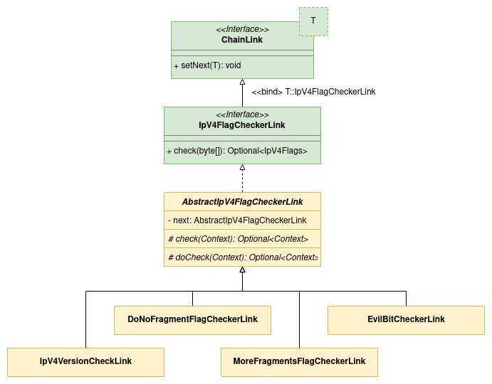

# Chain With Primary Link

This is an example of how to a chain of responsibility specifying which will be the first link with [COR Bean Processor Spring Boot Starter][cor-bean-processor].

The main objective of this project is to retrieve all flags from an IP version 4 package, including the [evil bit][evil-bit].  



The program will receive IP packages from both version 4 and version 6.
Since the flags are only available on version 4, the first link must check which package version is being passed (byte zero).
If the package version is 4, then the chain proceeds. If it is 6, then the chain ends, and it is returned an [empty optional][optional].

For the chain to work as expected, the first link must be the version filter or else it might check for flags on an invalid package.

## Highlights

[`IpV4FlagCheckerLink`][ip-v4-flag-checker-link] interface extends [COR Bean Processor Spring Boot Starter `ChainLink<T>` interface][chain-link] passing a self-reference as parameter. It also contains the entry method used to check the flags.
```java
public interface IpV4FlagCheckerLink extends ChainLink<IpV4FlagCheckerLink> {

  Optional<IpV4Flags> check(byte[] data);
}
```

Since it is necessary to keep the already found flags throughout the chain execution, it is necessary a class to preserve the flags along with the data being analysed.
[`Context`][context] class will be responsible for that, while flag values will be stored in a [`IpV4Flags`][ip-v4-flags] instance.
```java
class Context {

  private final byte[] data;
  
  private IpV4Flags ipV4Flags;
}
```
```java
public class IpV4Flags {

  private boolean doNotFragment;

  private boolean moreFragments;

  private boolean evilBit;
}
```

[`AbstractIpV4FlagCheckerLink`][abstract-ip-v4-flag-checker-link] is an abstract class that implements [`IpV4FlagCheckerLink`][ip-v4-flag-checker-link] interface. It implements `verify` method and `setNext` demanded by [`ChainLink`][chain-link] interface.
Since it is necessary to preserve the context throughout the chain execution, it also contains a redefined `check` method that will be used by the links to check the flags, but receiving a [`Context`][context] class instance instead of the IP package byte array.
Lastly, the abstract class will demand its specializations to implement the actual flag verification. This is done by declaring the abstract `doCheck` method.

```java
public abstract class AbstractIpV4FlagCheckerLink implements IpV4FlagCheckerLink {

  private AbstractIpV4FlagCheckerLink next;

  @Override
  public void setNext(IpV4FlagCheckerLink ipV4FlagCheckerLink) {
    /* Validation logic can be checked on the class implementation. */
    next = (AbstractIpV4FlagCheckerLink) ipV4FlagCheckerLink;
  }

  public Optional<IpV4Flags> check(byte[] data) { /* Full logic can be checked on the class implementation. */ }

  protected Optional<Context> check(Context context) { /* Full logic can be checked on the class implementation. */ }

  protected abstract Optional<Context> doCheck(Context context);
}
```

[`IpV4VersionCheckLink`][ip-v4-version-check-link] class extends [`AbstractIpV4FlagCheckerLink`][abstract-ip-v4-flag-checker-link] and is responsible to verify if the received IP package is of version 4, returning an empty context optional otherwise.
Since this must be the first link on our chain, we will add Spring [`@Primary`][primary] annotation on it.
```java
@Primary
public class IpV4VersionCheckLink extends AbstractIpV4FlagCheckerLink {

  @Override
  protected Optional<Context> doCheck(Context context) { /* Full logic can be found on the class implementation. */ }
}
```

[`IpService`][ip-service] encapsulates the components required to verify the IP version 4 package flags.
It contains a `retrieveIpV4Flags` method which invokes the first link `check` method, starting the chain analysis.

```java
public class IpService {

  private final IpV4FlagCheckerLink firstLink;

  public Optional<IpV4Flags> retrieveIpV4Flags(byte[] data) {
    return firstLink.check(data);
  }
}
```

[COR Bean Processor Spring Boot Starter][cor-bean-processor] will be responsible to chain all [`IpV4FlagCheckerLink`][ip-v4-flag-checker-link] implementations and inject [`IpV4VersionCheckLink`][ip-v4-version-check-link] on `firstLink` field.

## Execution

The complete integration with Spring Boot can be checked on [`IpServiceIT`][ip-service-it]. It is an integration test class and can be executed through an IDE like [IntelliJ IDEA][intellij-idea], [Eclipse][eclipse] or [Microsoft Visual Studio Code][microsoft-visual-studio-code].

Alternatively, the tests can also be executed through a terminal running the following command on this module root directory.

```bash
mvn failsafe:integration-test
```

[abstract-ip-v4-flag-checker-link]: ./src/main/java/com/figtreelake/primarylink/service/ip/link/AbstractIpV4FlagCheckerLink.java
[chain-link]: https://github.com/MarceloLeite2604/cor-bean-processor-spring-boot-autoconfiguration/blob/main/autoconfigure/src/main/java/com/figtreelake/corbeanprocessor/autoconfigure/link/ChainLink.java
[context]: ./src/main/java/com/figtreelake/primarylink/service/ip/link/Context.java
[cor-bean-processor]: https://github.com/MarceloLeite2604/cor-bean-processor-spring-boot-autoconfiguration
[eclipse]: https://www.eclipse.org/downloads/
[evil-bit]: https://en.wikipedia.org/wiki/Evil_bit
[intellij-idea]: https://www.jetbrains.com/idea/
[ip-service]: ./src/main/java/com/figtreelake/primarylink/service/ip/IpService.java
[ip-service-it]: ./src/test/java/com/figtreelake/primarylink/service/ip/IpServiceIT.java
[ip-v4-flag-checker-link]: ./src/main/java/com/figtreelake/primarylink/service/ip/link/IpV4FlagCheckerLink.java
[ip-v4-flags]: ./src/main/java/com/figtreelake/primarylink/IpV4Flags.java
[ip-v4-version-check-link]: ./src/main/java/com/figtreelake/primarylink/service/ip/link/IpV4VersionCheckLink.java
[microsoft-visual-studio-code]: https://code.visualstudio.com/download
[optional]: https://docs.oracle.com/en/java/javase/11/docs/api/java.base/java/util/Optional.html
[primary]: https://docs.spring.io/spring-framework/docs/current/javadoc-api/org/springframework/context/annotation/Primary.html