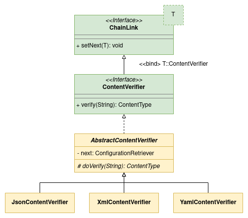
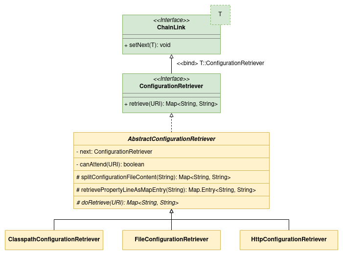

# Multiple Chains Example

This is an example of how to implement multiple chains of responsibility with [COR Bean Processor Spring Boot Starter](https://github.com/MarceloLeite2604/cor-bean-processor-spring-boot-autoconfiguration).

The main objective of this project is to retrieve configuration files of different types - XML, JSON or YAML - from different sources: File system, Java classpath or HTTP server.

