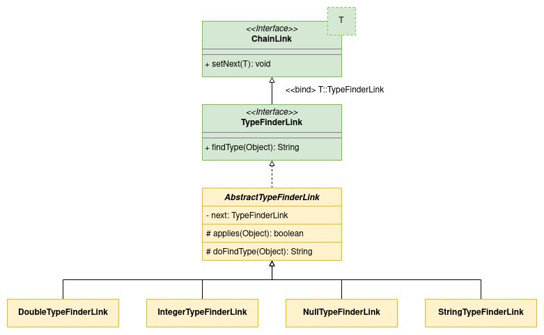

# Single Chain Example

This is the most simple and straightforward [COR Bean Processor Spring Boot Starter](https://github.com/MarceloLeite2604/cor-bean-processor-spring-boot-autoconfiguration) example. It contains a chain or responsibility to find out which type is an object: double, integer, null or string.



## Highlights

[`TypeFinderLink`][1] interface extends [COR Bean Processor Spring Boot Starter `ChainLink<T>` interface][3] passing a self-reference as parameter. It also contains the entry method used to find an object type. 
```java
public interface TypeFinderLink extends ChainLink<TypeFinderLink> {

    String findType(Object object);
}
```

[`AbstractTypeFinderLink`][2], as the name says, is an abstract class that implements [`TypeFinderLink`][1] interface.
It implements `findType` demanded by [`TypeFinderLink`][1] and `setNext` demanded by [`ChainLink`][3]. The latter is implemented using [Lombok `@Setter` annotation](https://projectlombok.org/features/GetterSetter).

```java
public abstract class AbstractTypeFinderLink implements TypeFinderLink {

    @Setter
    private TypeFinderLink next;

    @Override
    public String findType(Object object) { /* Full logic can be checked in the code implementation. */ }
}
```

[`TypeFinder`][4] encapsulates the components required to find an object type. It contains a `findType` method which invokes the first link `findType` method, starting the chain analysis.
```java
public class TypeFinder {

    private final TypeFinderLink firstLink;

    public String findType(Object object) {
        return firstLink.findType(object);
    }
}
```

[COR Bean Processor Spring Boot Starter](https://github.com/MarceloLeite2604/cor-bean-processor-spring-boot-autoconfiguration) will be responsible to chain all `TypeFinderLink` implementations and inject the first chain link on `firstLink` field. 

## Execution

The complete integration with Spring Boot can be checked on [`SingleChainExampleIT`][5] class. It is an integration test and can be executed through an IDE like [IntelliJ IDEA](https://www.jetbrains.com/idea/), [Eclipse](https://www.eclipse.org/downloads/) or [Visual Studio Code](https://code.visualstudio.com/download).

Alternatively, the test can also be executed through a terminal using the following command.

```bash
mvn failsafe:integration-test
```

[1]: ./src/main/java/com/figtreelake/singlechain/link/TypeFinderLink.java
[2]: ./src/main/java/com/figtreelake/singlechain/link/AbstractTypeFinderLink.java
[3]: https://github.com/MarceloLeite2604/cor-bean-processor-spring-boot-autoconfiguration/blob/main/autoconfigure/src/main/java/com/figtreelake/corbeanprocessor/autoconfigure/link/ChainLink.java
[4]: ./src/main/java/com/figtreelake/singlechain/TypeFinder.java
[5]: ./src/test/java/com/figtreelake/singlechain/SingleChainExampleIT.java